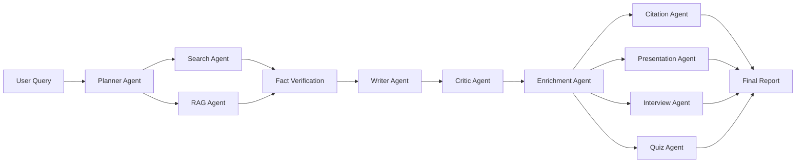

# Architecture & Diagrams

## High-Level Architecture

```
┌─────────────────────────────────────────────────────────────┐
│                       Streamlit UI Layer                     │
│  (Auth · Dashboard · Research · AI Chat · Reports · Profile) │
└───────────────────────────┬─────────────────────────────────┘
                            │
┌───────────────────────────▼─────────────────────────────────┐
│                        Services Layer                         │
│   AuthService · ResearchService · FileService · Visualization │
└───────────────────────────┬─────────────────────────────────┘
                            │
┌───────────────────────────▼─────────────────────────────────┐
│                  LangGraph Orchestrator (11 agents)           │
│  Planner → Search → RAG → FactVerify → Writer → Critic →     │
│  Enrichment → Citation → Presentation → Interview → Quiz     │
└───────────┬───────────────────────────────┬─────────────────┘
            │                               │
┌───────────▼───────────┐         ┌─────────▼──────────┐
│     RAG / FAISS        │         │   Gemini 2.5 Flash  │
│  Document Loader       │         │   (via LangChain)    │
│  Chunker · Embeddings  │         └──────────────────────┘
└───────────┬───────────┘
            │
┌───────────▼─────────────────────────────────────────────────┐
│                  SQLite Database (DAO layer)                  │
│  Users · Reports · Chats · Sessions · Files · Feedback · BM  │
└──────────────────────────────────────────────────────────────┘
```

## Agent Sequence Diagram

```
User  UI   Orchestrator  Planner  Search  RAG  FactVerify  Writer  Critic  Enrichment  Citation  Presentation  Interview  Quiz
 |     |        |           |       |      |       |          |      |        |           |          |            |         |
 |--query-->   |           |       |      |       |          |      |        |           |          |            |         |
 |     |--run-->           |       |      |       |          |      |        |           |          |            |         |
 |     |        |--tasks-->|       |      |       |          |      |        |           |          |            |         |
 |     |        |          |--results-->   |       |          |      |        |           |          |            |         |
 |     |        |          |       |      |--docs-->         |      |        |           |          |            |         |
 |     |        |          |       |      |       |--facts-->|      |        |           |          |            |         |
 |     |        |          |       |      |       |          |--draft---->   |           |          |            |         |
 |     |        |          |       |      |       |          |      |--improved-->      |           |          |            |         |
 |     |        |          |       |      |       |          |      |        |--meta-->|          |            |         |
 |     |        |          |       |      |       |          |      |        |           |--refs-->|            |         |
 |     |        |          |       |      |       |          |      |        |           |          |--slides-->|         |
 |     |        |          |       |      |       |          |      |        |           |          |            |--Q&A-->|
 |     |        |          |       |      |       |          |      |        |           |          |            |         |--mcqs-->|
 |<--state--|<--return----|       |      |       |          |      |        |           |          |            |         |
```

## RAG Data Flow

```
Upload (PDF/DOCX/TXT)
   → extract_text()
   → chunk_text() (sliding window, 800 words, 120 overlap)
   → embed_texts() (Gemini embeddings)
   → FAISS IndexFlatL2 (persisted to disk)
Query
   → embed_query() → faiss.search(k=5) → top chunks → LLM context
```

## Database ER (simplified)

```
users 1───* reports *───1 bookmarks
users 1───* chats
users 1───* sessions
users 1───* uploaded_files
users 1───* feedback
```

## Flow Diagram (Mermaid)


